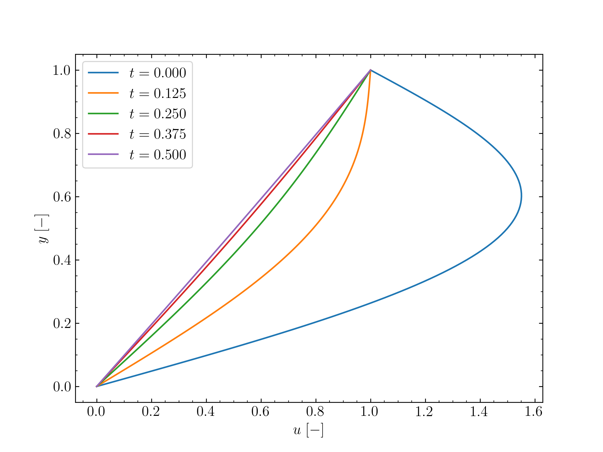
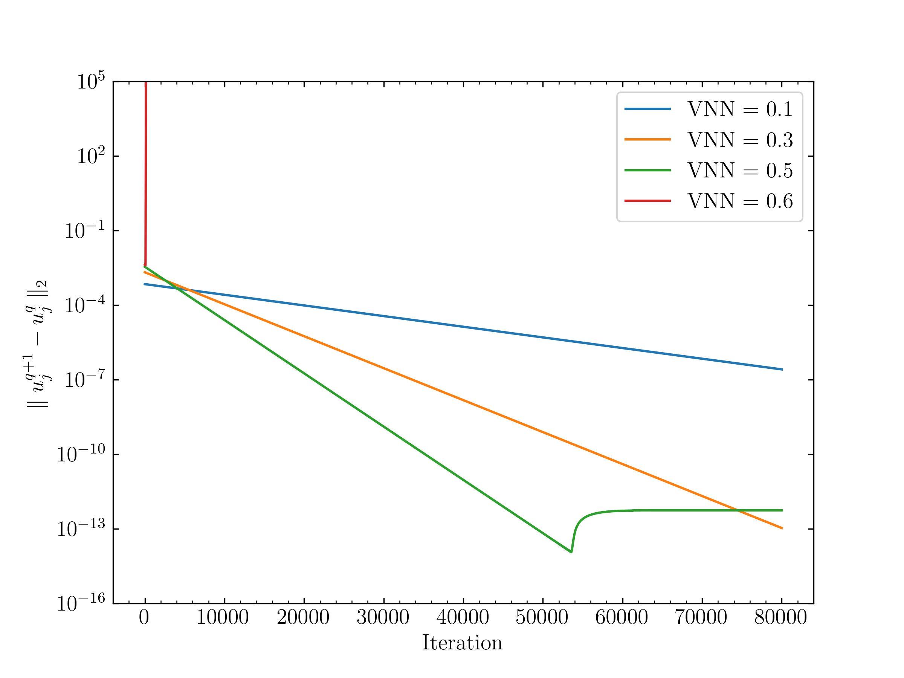
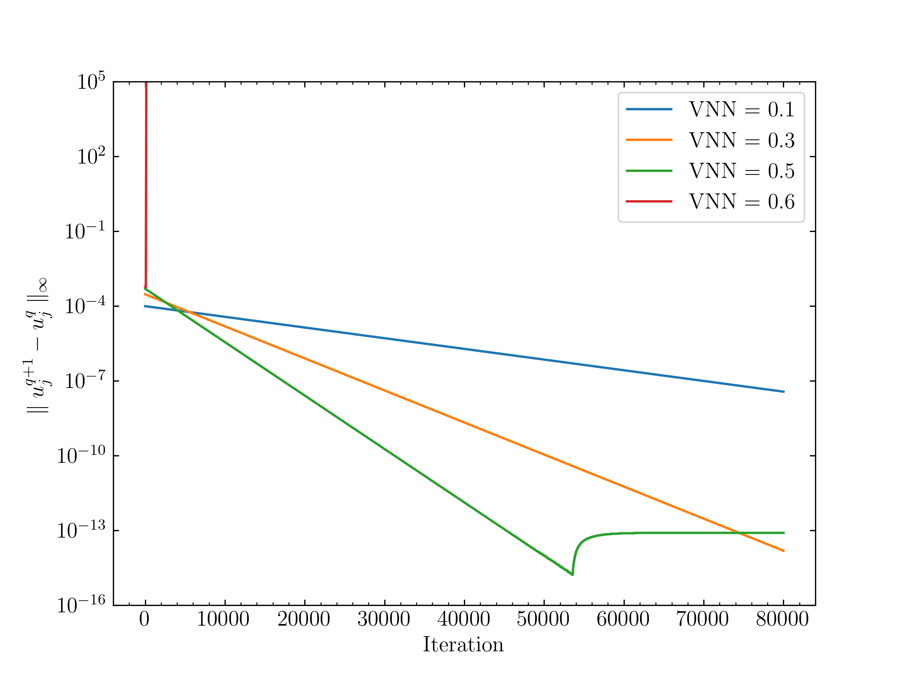

# Outline

Solve 1d scalar equation in a couette flow configuration.

# Capabilities:

Time-accurate and -marching capabilities, for the former after an initial setup
of the desired VNN, local time steps are computed and the minimum is returned to
be further used throughout the simulation. For the latter, an analogous operation
is executed, except for returning the minimum time step, all local time steps are
stored and used locally at each grid point for faster convergence.

Additionally, binary file output is implemented and compatible with numpy arrays.

# Instructions:

1. compile the code with ```sh compile.sh```
2. run the executables ```./time-accurate.x``` or ```./time-marching.x```. Folder
creation is required to be manually done, one should create the following: out/time-accurate,
out/time-marching/VNN_xx (where xx your representation of the VNN number to be
used, eg, 05 for 0.5, you may also need to update the folder string in the time-marching.cpp
file wherever files are saved);
3. post-process your results with ```python plot_time_accurate.py```, ``` python plot_time_marching.py```,
here latex is used to write the legends and labels.

# Results:

In spite of the generic implementation, since both the grid and the fluid proper-
ties are constant, the time step is the same everywhere. The only difference is
the error norms $L_2$ and $L_\infty$ computations for the time-marching problem.

For the time-accurate problem, the instantaneous solution for a VNN=0.5:



For the time-marching problem, the comparison of the error norms for different
VNNs follows:




